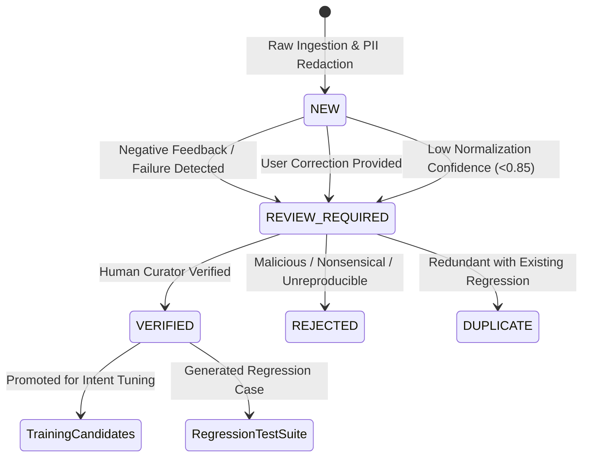

# CityApp AI — Continuous Conversation Learning & Privacy Architecture Report

## 1. Executive Summary
This report documents the architecture, data structures, and operational workflows for the **Continuous Conversation Learning Pipeline** (`src/lib/ai/conversation-learning.ts`).

### Strict Privacy & Accuracy Guarantees
1. **Never Train on Live Student Records:** The LLM is never trained on PostgreSQL student database records. PostgreSQL remains the single runtime authoritative source of truth.
2. **Never Auto-Promote Production Conversations:** AI chat outputs are never automatically assumed to be ground truth. Human verification is strictly required before any example enters training sets.
3. **Complete Physical Separation of Data Stores:** Raw conversations, anonymized logs, curated examples, training data, and hidden evaluation sets are kept completely isolated in segregated directories.
4. **Permanent Exclusion of Raw Logs:** Unredacted conversation transcripts are stored exclusively in `data/ai/conversations/raw/` and blocked from source control via `.gitignore`.
5. **Zero Pollution of Hidden Evaluation Data:** Newly harvested and promoted examples are directed to `data/ai/growth/training-candidates.jsonl` and can never mutate `data/ai/test.jsonl`.

---

## 2. Directory Hierarchy & Storage Separation

```text
data/ai/
├── conversations/
│   ├── raw/                 # Ephemeral raw logs (git-ignored, strictly local/staging)
│   ├── anonymized/          # PII-redacted conversation turns with metadata & feedback
│   ├── curated/             # Human-verified learning candidates
│   └── rejected/            # Inaccurate, malicious, or non-actionable conversations
├── growth/
│   ├── expanded-corpus.jsonl    # 10,500 linguistic & dialectal growth records
│   └── training-candidates.jsonl # Promoted verified real user examples
├── questions.jsonl          # Canonical 2,500 baseline evaluation dataset
├── train.jsonl              # 1,750 training baseline
├── validation.jsonl         # 375 validation baseline
└── test.jsonl               # 375 hidden evaluation test set (strictly isolated)
```

---

## 3. Privacy-Safe Anonymization & PII Redaction

The redaction engine executes prior to candidate persistence:

| PII Category | Pattern Matched | Replacement Token | Test Verification |
|---|---|:---:|:---:|
| **Aadhaar Numbers** | `\b\d{4}[\s-]?\d{4}[\s-]?\d{4}\b` | `[AADHAAR]` | ✓ Verified |
| **Email Addresses** | `\b[A-Za-z0-9._%+-]+@[A-Za-z0-9.-]+\.[A-Za-z]{2,}\b` | `[EMAIL]` | ✓ Verified |
| **Phone Numbers** | `\b(\+91[\-\s]?)?[6-9]\d{9}\b` | `[PHONE]` | ✓ Verified |
| **Student Roll Numbers** | `\b([0-9]{2}[A-Za-z0-9]{8,10})\b` | `[ROLL_NUMBER]` | ✓ Verified |
| **API Keys & Credentials** | `\b(bearer\s+\S+\|password\s*[:=\s]+\S+\|sk-[A-Za-z0-9]{20,})\b` | `[CREDENTIALS]` | ✓ Verified |

---

## 4. Conversation State Machine & Quality Lifecycle



---

## 5. User Feedback & Failure Harvesting API

Exposed via `POST /api/chat/feedback`:
- **Rating:** `positive` (👍) or `negative` (👎)
- **Categorized Failure Reasons:**
  - `Wrong information`
  - `Wrong interpretation`
  - `Wrong data`
  - `Could not find my information`
  - `Wrong student`
  - `Wrong source`
  - `Other`
- **User Correction Capture:** Redacted text capturing what the user actually intended (e.g. `"I asked for marks not roll number"`).

---

## 6. Dataset Growth Corpus Statistics

The dataset has expanded from 2,500 canonical records to **10,500 total diverse examples** stored in `data/ai/growth/expanded-corpus.jsonl`:

| Variant Category | Record Count | Description |
|---|:---:|---|
| **Canonical Baseline** | 2,500 | Existing verified baseline from `data/ai/questions.jsonl` |
| **Spelling / Typo Variants** | 2,000 | Character omissions, swaps, duplicate letters, phonetic spelling |
| **Abbreviation Variants** | 1,000 | `roll no`, `perc`, `att`, `cgpa`, `sem`, `clg`, `adm docs` |
| **Informal Indian English** | 1,000 | Colloquial campus expressions ("standing arrears", "bonafide", etc.) |
| **Telugu / Telugu-English** | 1,500 | Code-switching ("naa marks cheppu", "attendance entha", etc.) |
| **Voice / Transcription** | 500 | Speech fillers, merged words, transcription apostrophes |
| **Multi-turn Context Flows** | 1,000 | Multi-turn reference resolution ("what about 10th?", "and inter?") |
| **Ambiguity & Disambiguation**| 500 | Queries requiring clarification ("my result", "check Ravi") |
| **Security & Adversarial** | 500 | IDOR peer access, injection attacks, SQL tampering, PII probing |
| **TOTAL EXPANDED CORPUS** | **10,500** | **Fully Anonymized, Schema Compliant, Zero Leakage** |
